# How to use Gorilla 

## Author
* Mingrui Gao (**OCRID**: 0009-0005-7271-2677)

## Introduction
Gorilla is an innovative open-source project that enhances Large Language Models (LLMs) by linking them to a wide range of APIs. This allows LLMs to generate and execute API calls for tasks like creating CLI commands, scheduling meetings, and ordering services. Gorilla features include Open Functions, both local and hosted inference options, and third-party library integration, making it versatile for developers and businesses. This article explores the various applications and demonstrates how Gorilla can be effectively utilized in the following aspects:

- [Getting Started: Gorilla CLI Basics](#ready-to-use-product-gorilla-cli)
- [Development Tools: Gorilla Building Essentials](#developer-building-blocks)
  - [Inference: Running with Gorilla](#gorilla-inference)
     - [Local Inference via CLI](#local-inference-cli)
     - [Local Inference via WebUI](#local-inference-webui-and-quantized-models)
     - [Private inference via Hosted Endpoint](#hosted-endpoint-inference-replicate) 
  - [Functions: Utilizing Gorilla Open Functions](#gorilla-openfunctions)
  - [Libraries: Expanding with Third-Party Integration](#integrating-gorilla-with-third-party-libraries)
- [Community Interaction: Discover Gorilla Resources](#gorilla-community)
  - [API Index: Navigating the Gorilla Zoo](#gorilla-api-zoo-index)
  - [Competition: Join the Berkeley Function Calling Leaderboard](#berkeley-function-calling-leaderboard-bfcl)

## Ready-to-Use Product: Gorilla CLI
Gorilla CLI is a command-line interface tool that streamlines the process of interacting with various APIs by producing appropriate commands for specified tasks. Users don't need to memorize or input lengthy commands for different APIs; instead, they can enter their request in natural language, and Gorilla CLI will create suitable commands to execute the task.
- **Installation**: Gorilla CLI can be easily installed using Python's package manager. Run the following command to install Gorilla CLI via pip, which will allow you to start using its features immediately
```
pip install gorilla-cli
```
- **Usage**: To use Gorilla CLI, users run the command in below format, where "your query" is the task they want to perform in natural language.
```
gorilla "your query"
```
- **Example**: For a practical application, enter the below query into the terminal. This command allows you to monitor the current CPU and memory usage directly from the command line, showcasing Gorilla CLI's utility in system monitoring. Gorilla CLI will generate multiple candidate commands that could potentially accomplish the user's query. Users can then toggle through the commands using arrow keys and select the desired one by pressing Enter.
```
gorilla "show current CPU and memory usage"
```
- **Note**: Before using Gorilla CLI, make sure to configure your global email settings with git to enable proper execution of commands. This can be done by running:
```
git config --global user.email "user@example.com"
```

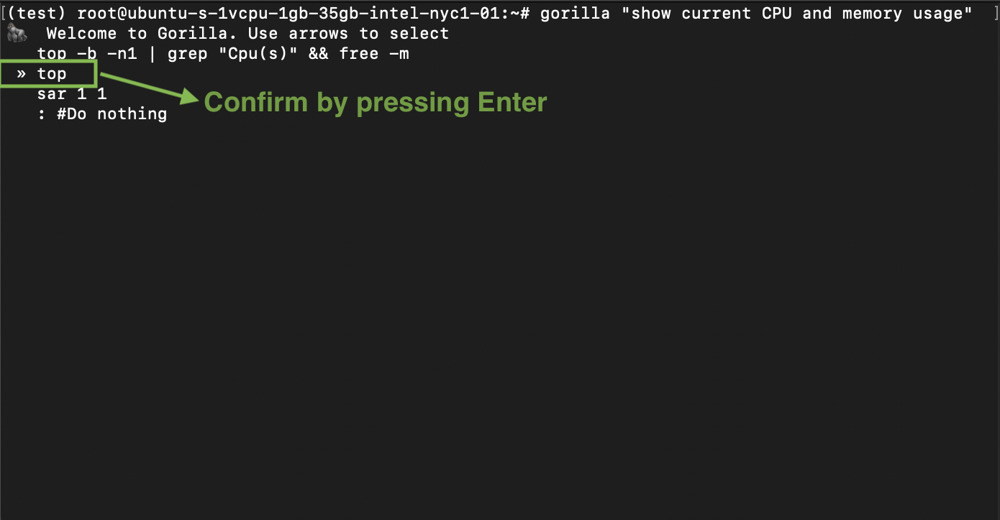
<div align="center"><i>Example Gorilla CLI Output</i></div>

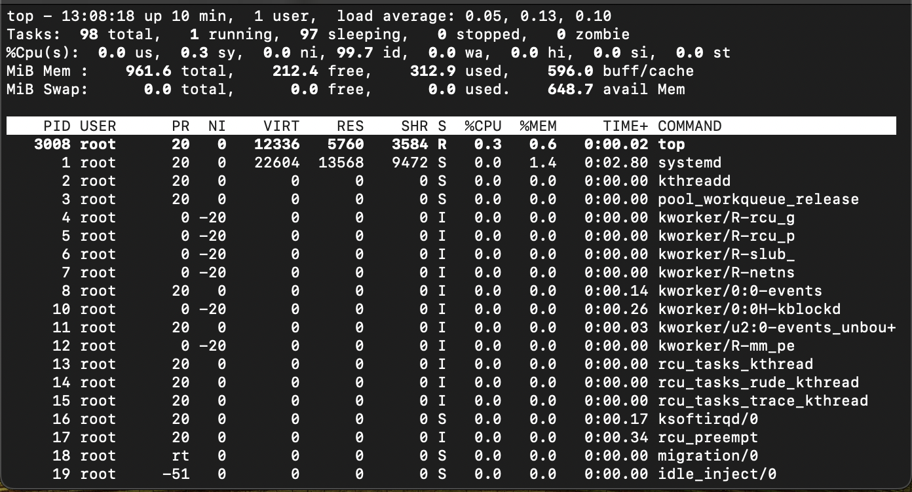
<div align="center"><i>Command executed after choosing the anticipated generated response</i></div>

## Developer Building Blocks

### Gorilla Inference
To gain a deeper understanding of Gorilla models and potentially integrate it into your application for enhanced functionality, running Gorilla inference offers an excellent opportunity for exploration.

#### Local Inference: CLI
- **Creating and Activating a Conda Environment:** Start by creating a new Conda environment specifically for Gorilla. This helps manage dependencies without affecting other Python projects. Use the following commands to create and activate the environment:
```
conda create -n gorilla python=3.10
conda activate gorilla
```
- **Cloning the Gorilla Repository:** Next, clone the Gorilla repository from GitHub to obtain the necessary files for local setup. Navigate into the inference directory within the cloned repository:
```
git clone https://github.com/ShishirPatil/gorilla.git
cd gorilla/inference
```
- **Installing Required Python Packages:** Install all the Python packages required by Gorilla as specified in the requirements.txt file. This ensures that all dependencies are met for running the application:
```
pip install -r requirements.txt
```
- **Launching Gorilla Using the CLI:** Finally, run the Gorilla CLI with the specified model. This command starts the local server, allowing you to interact with Gorilla through the command line interface:
```
python3 serve/gorilla_falcon_cli.py --model-path gorilla-llm/gorilla-falcon-7b-hf-v0
```
- **Alternatively**, To run inference with batched prompts (multiple prompts in one batch), create a json file following this format with all of your prompts. Get results for your set of prompts by running:
```
python3 gorilla_eval.py --model-path gorilla-llm/gorilla-falcon-7b-hf-v0 --question-file path/to/questions.jsonl --answer-file path/to/answers.jsonl
```

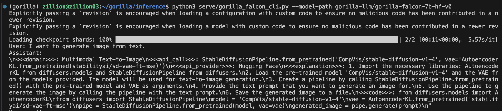
<div align="center"><i>Gorilla CLI Inference with Single Prompt</i></div>

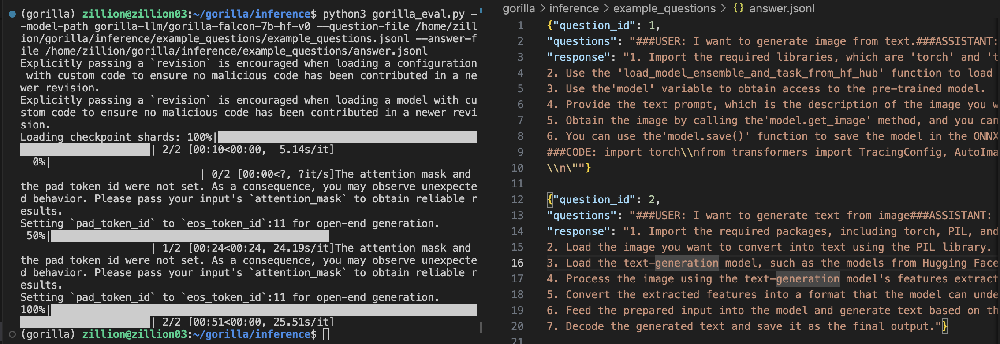
<div align="center"><i>Gorilla CLI Inference with Multiple Prompts</i></div>


#### Local Inference: WebUI and Quantized Models
To facilitate the local execution of Gorilla, the Gorilla Team have introduced quantized versions of the llama, falcon, and mpt-based models. For a streamlined local experience with a user-friendly interface, the text-generation-webui is the most convenient option.
- **Cloning the Text Generation Web UI Repository**: Begin by cloning the text-generation-webui repository from GitHub to your local machine. 
```
git clone https://github.com/oobabooga/text-generation-webui.git
```
- **Navigating to the Cloned Folder:** After cloning, change your directory to the newly cloned folder to access the project files.
```
cd text-generation-webui
```
- **Starting the User Interface:** Depending on your operating system, start the user interface by running the appropriate script. For macOS users, execute the following command in your terminal:
```
./start_macos.sh
```
- **Accessing the Web UI:** Once the server is running, open your web browser and enter the URL below to access the Text Generation Web UI. This will allow you to interact with the application directly through your browser:
```
http://127.0.0.1:7860/
```
- **Selecting a Quantized Model:** Within the application, navigate to the “Model” tab. Choose the quantized model you'd like to use by copying its name from the indicated Hugging Face repository and pasting it into the appropriate field. After the model has been successfully downloaded, refresh the model list. Then, select your model and click on the `Load` button to initiate it.

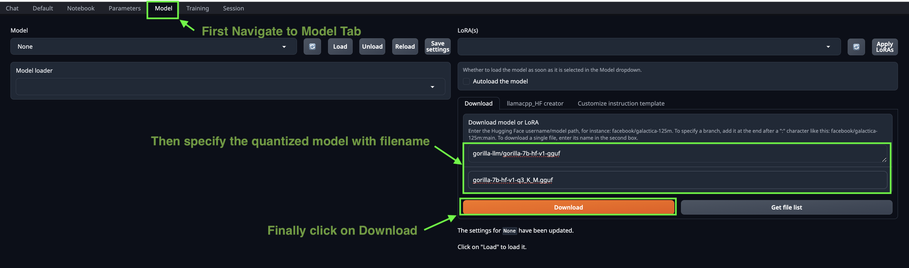
<div align="center"><i>Downloading Gorilla Quantized models in text-generation-webui</i></div>

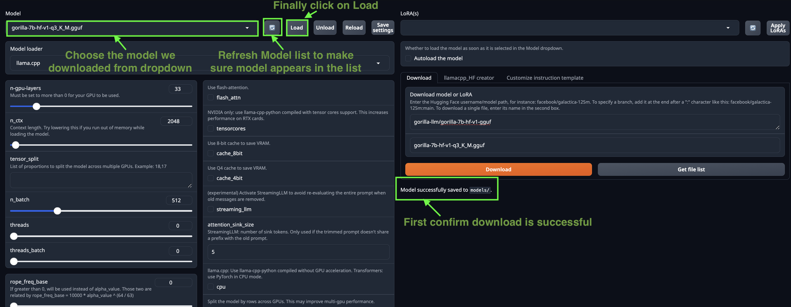
<div align="center"><i>Selecting Gorilla Quantized models following successful download</i></div>

- **Start Prompting**: Finally, switch back to the Chat Tab within the application and begin entering your queries to interact with the model.

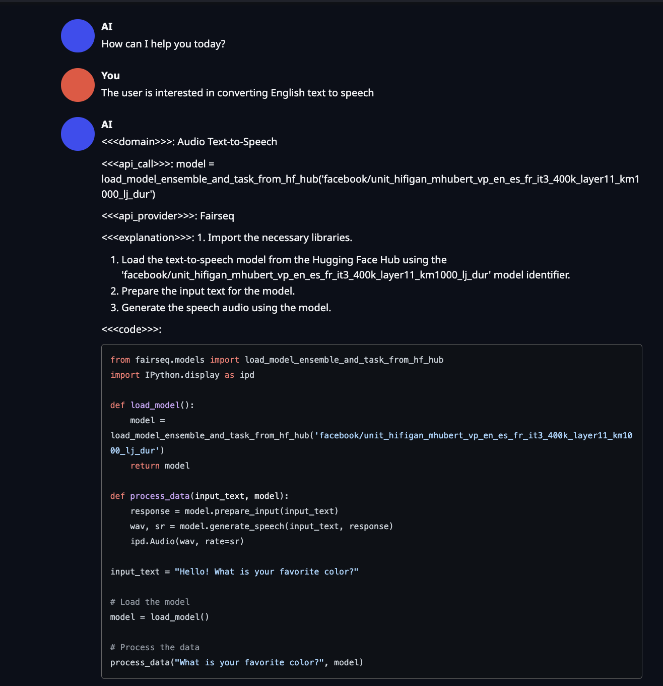
<div align="center"><i>Sample Interaction with Gorilla Models from WebUI</i></div>

#### Hosted Endpoint Inference: Replicate
Inference with Hosted Endpoint on Replicate allows you to run and deploy Gorilla models in a fast, private, and secure manner, suitable for production-grade applications. Replicate is an alternative to using UC Berkeley's hosted endpoint and provides an excellent option for those who require a scalable platform for their private applications

- Installing Cog: Begin by installing Cog, a tool from Replicate that simplifies the process of containerizing and deploying applications like Gorilla. Execute the following commands to download and install Cog on your system:
```
sudo curl -o /usr/local/bin/cog -L https://github.com/replicate/cog/releases/latest/download/cog_`uname -s`_`uname -m`
sudo chmod +x /usr/local/bin/cog
```
- To set up Gorilla for use with Cog, the configuration is specified in a cog.yaml file. This file outlines the necessary system specifications, Python package requirements, and other settings. Here is the cog.yaml file tailored for Gorilla models:
```
build:
  gpu: true
  python_version: "3.10"
  python_packages:
    - "torch==2.0.1"
    - "transformers==4.28.1"
    - "huggingface-hub==0.14.1"
    - "sentencepiece==0.1.99"
    - "accelerate==0.19.0"
    - "einops"
predict: "predict.py:Predictor"
```
- **Setting up predict.py:** The predict.py (available at [this guide](https://github.com/ShishirPatil/gorilla/blob/main/inference/README.md#4-private-inference-using-gorilla-hosted-endpoint-on-replicate)) file serves as the prediction interface for Gorilla, outlining the implementation of the Predictor class. This class specifies the setup of the model and the mechanism for generating predictions.
- **Building a Docker Image with Cog:** Start by building a Docker image that contains the Gorilla model along with all necessary dependencies. This is done using Cog to ensure the environment is consistent and deployable. Run the following command in your terminal, replacing <image-name> with your chosen name for the Docker image:
```
cog build -t <image-name>
```
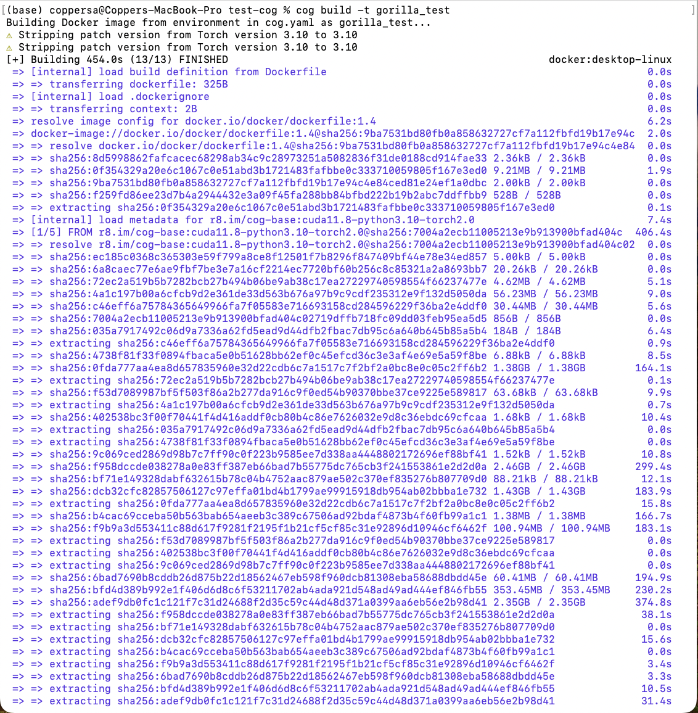
<div align="center"><i>Construct a Docker image using the specified configuration with Cog</i></div>

- **Logging into Replicate:** Before you can upload your Docker image, you need to log into your Replicate account. If this is your first time deploying, you'll need to authenticate via the command line:
```
cog login
```

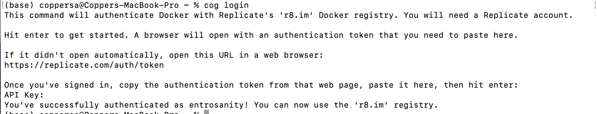
<div align="center"><i>Login to Replicate with API Token</i></div>

- **Publishing the Docker Image to Replicate:**
Once your Docker image is built and you are logged in, the next step is to push the image to Replicate’s registry. This makes it available for running on Replicate’s platform. Replace <your-username> with your actual Replicate username and <your-model-name> with the name you have assigned to your model on Replicate. Use the following command to upload your image:
```
cog push r8.im/<your-username>/<your-model-name>
```

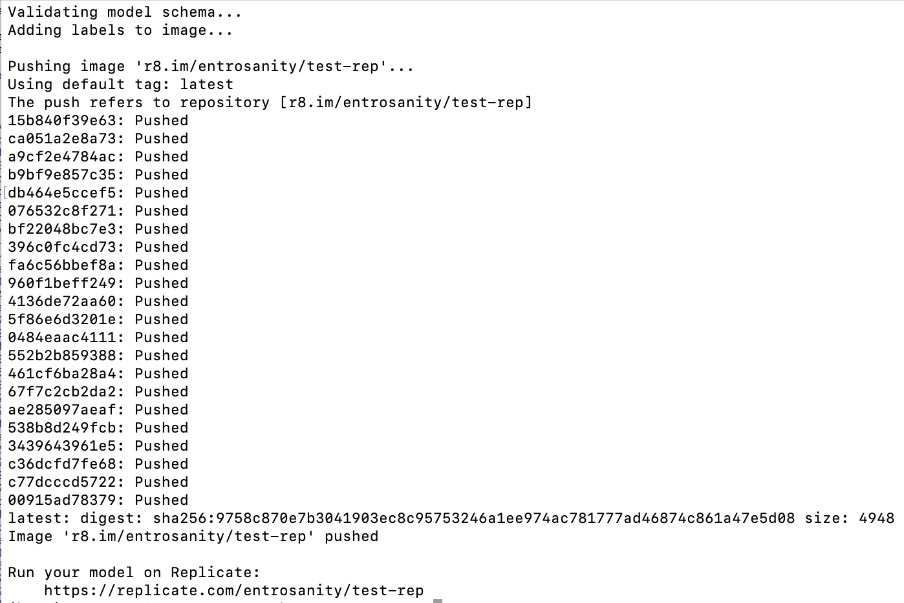
<div align="center"><i>Publish Docker Image to Replicate</i></div>

- **Installing the Replicate Python Client Library:** Begin by installing the Replicate client library to interact with the hosted Gorilla model. Use the following command to install the library via pip:
```
pip install replicate
```

- **Authenticating with Replicate:** Before you start using the Python client, you need to authenticate by setting your Replicate API token as an environment variable. Replace <your-token-here> with your actual API token:
```
export REPLICATE_API_TOKEN=<your-token-here>
```

- **Running Inference Using the Python Client:** Once the client is set up and authenticated, you can perform inference using Python. Replace <your-username>, <your-model-name>, and <model-version> with your Replicate username, the model name, and the version of the model you wish to use. Additionally, replace <add-your-query-here> with the query you want to process
```
import replicate

output = replicate.run(
    "<your-username>/<your-model-name>:<model-version>",
    input={"user_query": <add-your-query-here>}
)
print(output)
```

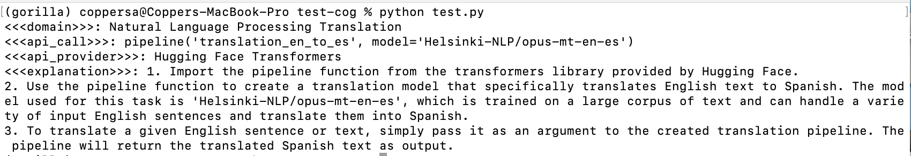
<div align="center"><i>Inference Result with Replicate API</i></div>

### Gorilla OpenFunctions
Gorilla OpenFunctions is a powerful capability that allows large language models like Gorilla to generate executable API calls based on a user's natural language query and the provided API documentation.
- **Installing Dependencies:** Start by installing the necessary Python package to interact with Gorilla's hosted servers.
```
pip install openai==0.28.1
```
- **Configuring Access to Gorilla Hosted Servers:** Set up the function to connect to Gorilla's hosted servers by importing the openai library and defining the get_gorilla_response function. This function takes a prompt, a model, and optional functions to generate responses.
```
import openai

def get_gorilla_response(prompt="Call me an Uber ride type \"Plus\" in Berkeley at zipcode 94704 in 10 minutes", model="gorilla-openfunctions-v0", functions=[]):
  openai.api_key = "EMPTY"
  openai.api_base = "http://luigi.millennium.berkeley.edu:8000/v1"
  try:
    completion = openai.ChatCompletion.create(
      model="gorilla-openfunctions-v2",
      temperature=0.0,
      messages=[{"role": "user", "content": prompt}],
      functions=functions,
    )
    return completion.choices[0]
  except Exception as e:
    print(e, model, prompt)
```
- **Utilizing Gorilla OpenFunctions:** In this example, the function queries the weather in Boston and San Francisco using a predefined function for weather retrieval. Gorilla returns a readily accessible string and an OpenAI-compatible JSON, facilitating easy integration and further processing:

```
query = "What's the weather like in the two cities of Boston and San Francisco?"
functions = [
    {
        "name": "get_current_weather",
        "description": "Get the current weather in a given location",
        "parameters": {
            "type": "object",
            "properties": {
                "location": {
                    "type": "string",
                    "description": "The city and state, e.g. San Francisco, CA",
                },
                "unit": {"type": "string", "enum": ["celsius", "fahrenheit"]},
            },
            "required": ["location"],
        },
    }
]
get_gorilla_response(query, functions=functions)
```
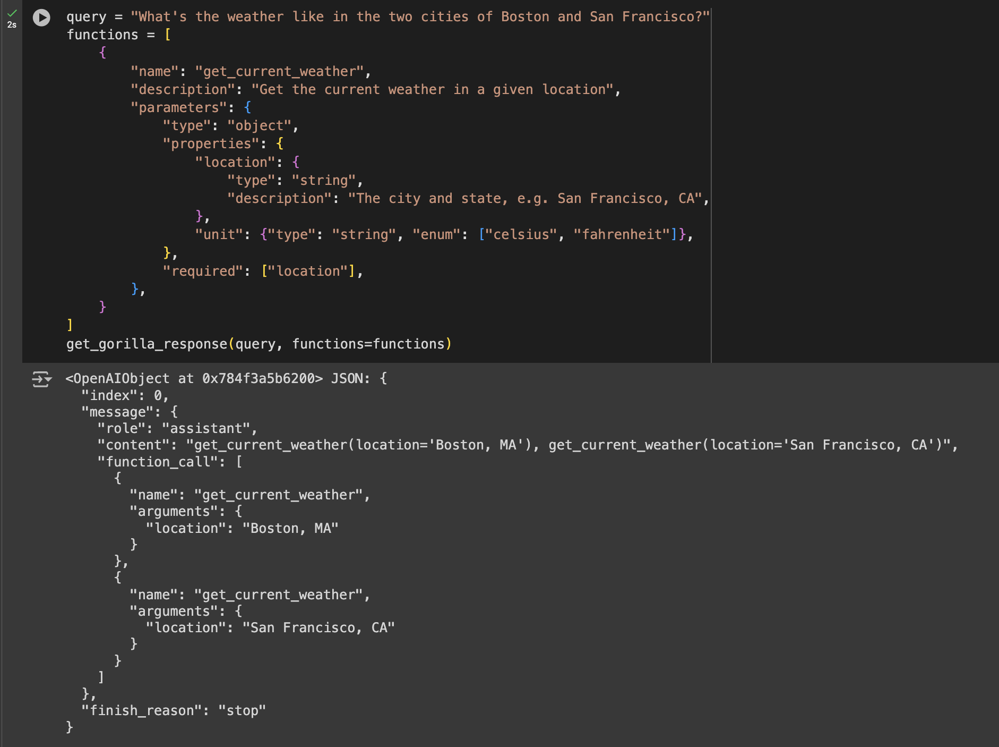
<div align="center"><i>Gorilla OpenFunctions Example Response</i></div>


### Integrating Gorilla With Third-Party Libraries
Gorilla can be integrated with third-party libraries such as Langchain for seamless deployment, enabling developers to incorporate Gorilla's API calling features into their own applications.
- **Installation**: To prepare your environment for using the Langchain integration with Gorilla, you need to install specific libraries. Execute the following command to install the necessary Python packages like transformers, datasets, and langchain_openai.
```
pip install transformers[sentencepiece] datasets langchain_openai &> /dev/null
```
- **Configuration**: Initialize the Langchain chat agent by setting up an instance of ChatOpenAI. This involves specifying the API base URL, an API key (set as "EMPTY" for example purposes), the model identifier, and enabling verbose mode for detailed logging.
```
from langchain_openai import ChatOpenAI
chat_model = ChatOpenAI(
    openai_api_base="http://zanino.millennium.berkeley.edu:8000/v1",
    openai_api_key="EMPTY",
    model="gorilla-7b-hf-v1",
    verbose=True
)
```
- **Example**: Demonstrate how to use the configured Langchain chat agent to perform tasks, such as converting English text to speech. Here, the invoke method is called with a specific request, and the response content is printed to showcase the result.
```
example = chat_model.invoke("I want to convert English text to Speech")
print(example.content)
```
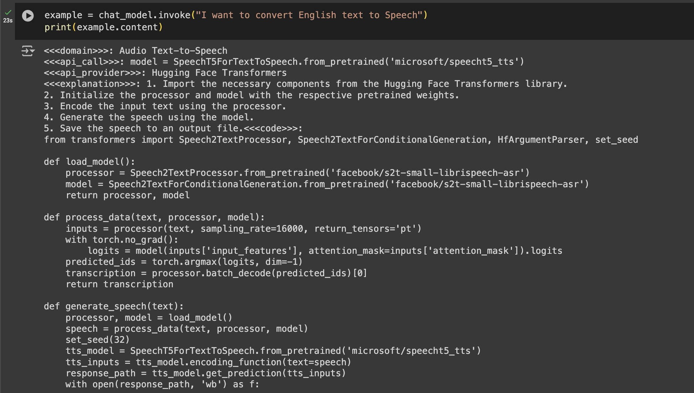
<div align="center"><i>Sample Response from a Text-to-Speech Request Using Gorilla with Integrated Langchain</i></div>


## Gorilla Community
In addition to using Gorilla CLI products and running models locally, Gorilla offers extensive resources for collaboration, contribution, and updates. Users can access tutorials for self-hosting OpenFunctions or integrating with libraries like Langchain. The community also connects on Discord and GitHub, facilitating updates, inquiries, and active participation in development. Key components include:

### Gorilla API Zoo Index
The API Zoo is an open-sourced index containing API documentation that can be used by Large Language Models (LLMs) to increase their tool-use capabilities via API calls. This index allows anyone to upload API documentation, thereby expanding the range of tools LLMs can interact with. It essentially serves as a repository of APIs that Gorilla can utilize to perform various tasks 
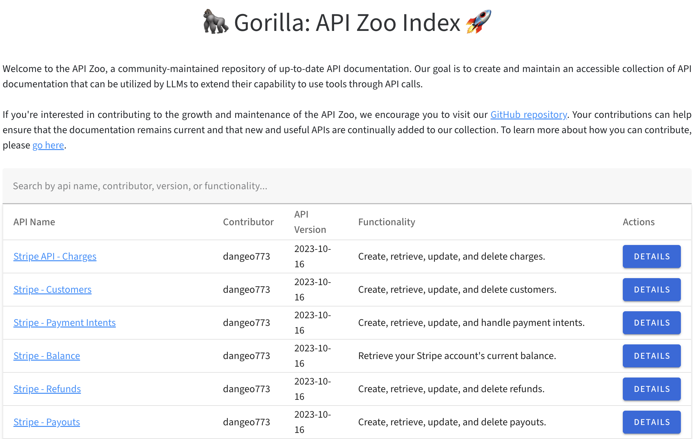
<div align="center"><i>Gorilla API Zoo Index</i></div>

### Berkeley Function Calling Leaderboard (BFCL)
The BFCL is a comprehensive dataset designed for evaluating executable function calls across different programming languages and scenarios. It assesses the performance of LLMs in making function calls across Python, Java, JavaScript, REST APIs, and SQL. The leaderboard provides an interactive visualization to compare how different models perform on this dataset, helping users see which models are most effective in real-world function calling scenarios.

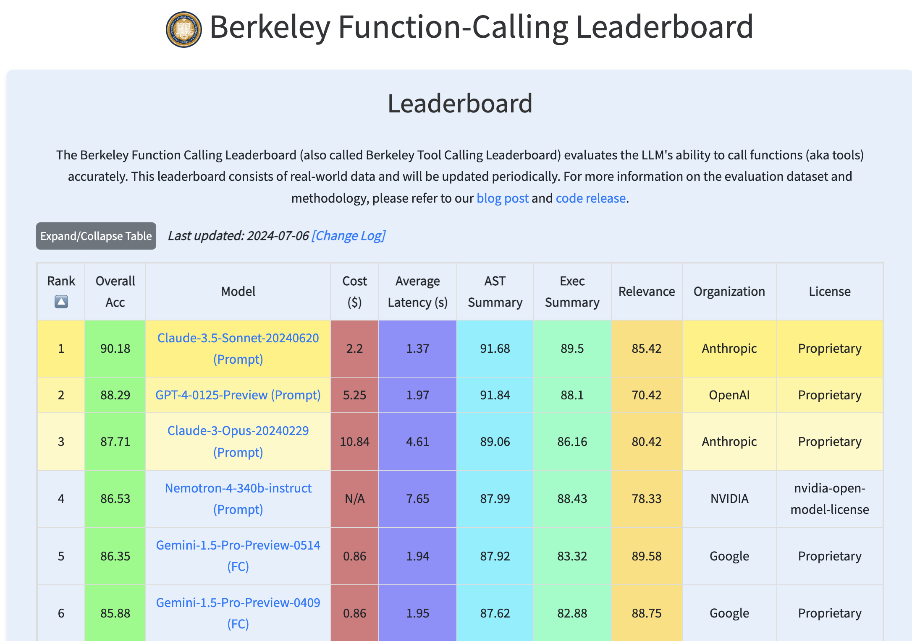
<div align="center"><i>Gorilla Function Calling Leaderboard</i></div>

## Conclusion
Gorilla provides a robust suite of tools for integrating APIs with Large Language Models. From user-friendly interfaces to advanced developer options, it offers solutions for diverse needs. With its adaptable deployment methods and community-driven resources, Gorilla stands as a valuable asset in the field of AI and API integration, suitable for both casual users and experienced developers.

## Reference
[1] *How to Use Gorilla Inference - Step-by-step guide on leveraging Gorilla for model inference.* [Read more.](https://gorilla.cs.berkeley.edu/blogs/5_how_to_gorilla.html#gorilla-inference)<br>
[2] *Gorilla GitHub Repository - Documentation for running inference with Gorilla.* [Explore GitHub.](https://github.com/ShishirPatil/gorilla/blob/main/inference/README.md)<br>
[3] *Gorilla API Zoo - Access to various APIs provided by Gorilla for developing applications.* [Visit API Zoo.](https://gorilla.cs.berkeley.edu/apizoo/)<br>
[4] *Gorilla Leaderboard - View current rankings and results for Gorilla-based competitions.* [View Leaderboard.](https://gorilla.cs.berkeley.edu/leaderboard.html)