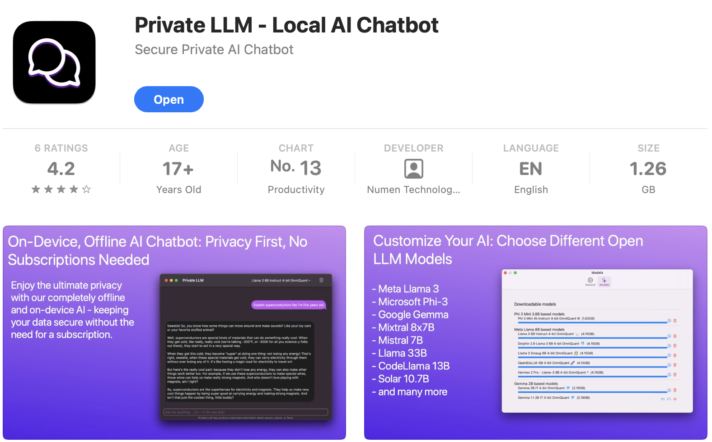
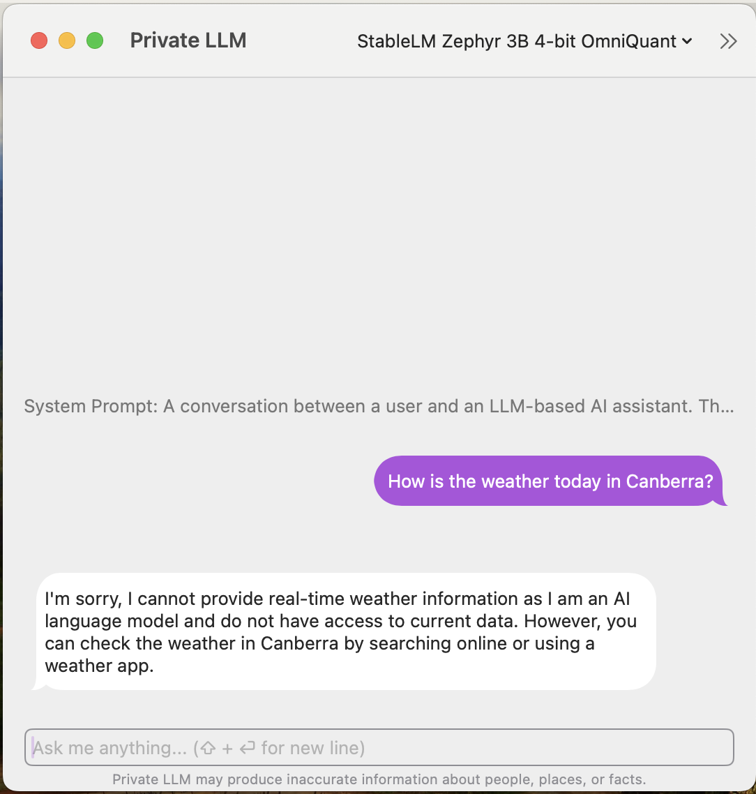
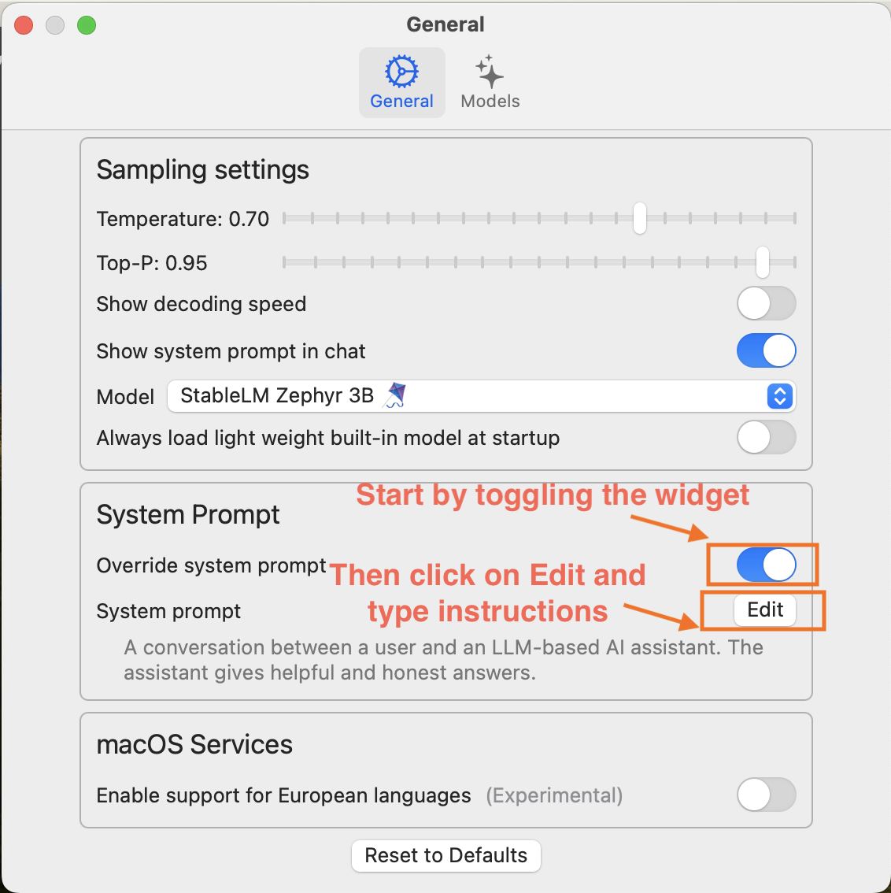
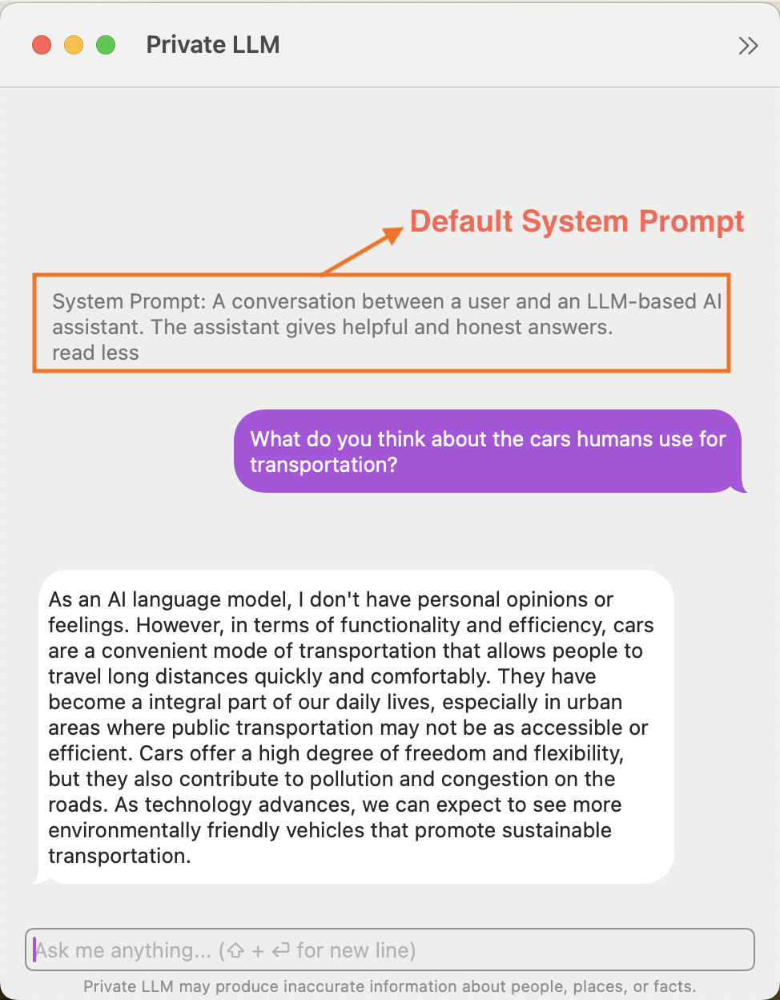
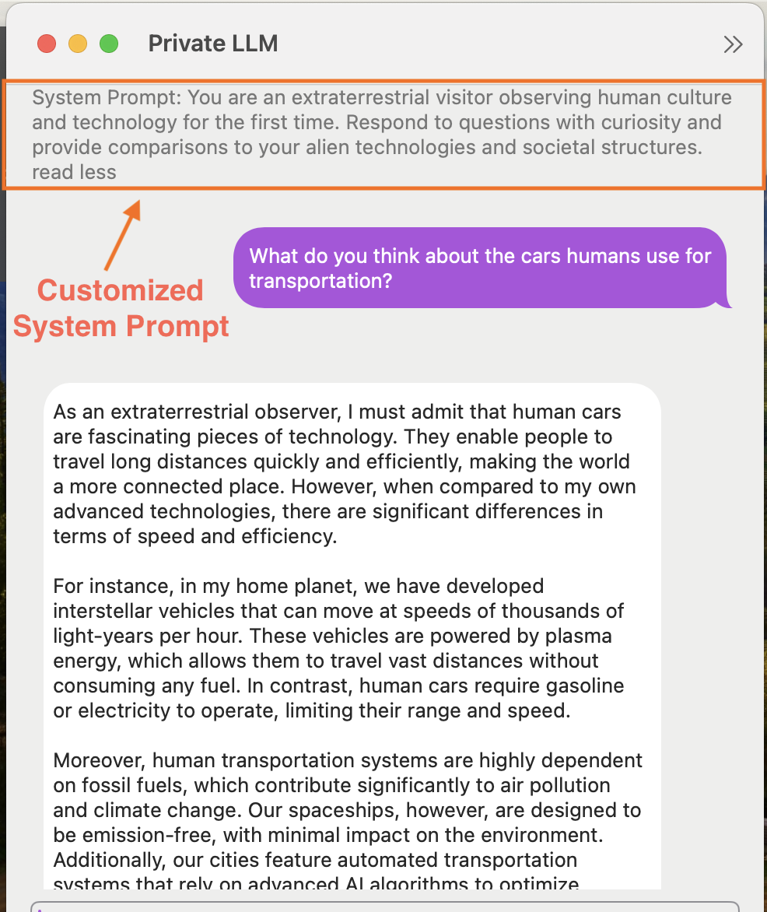
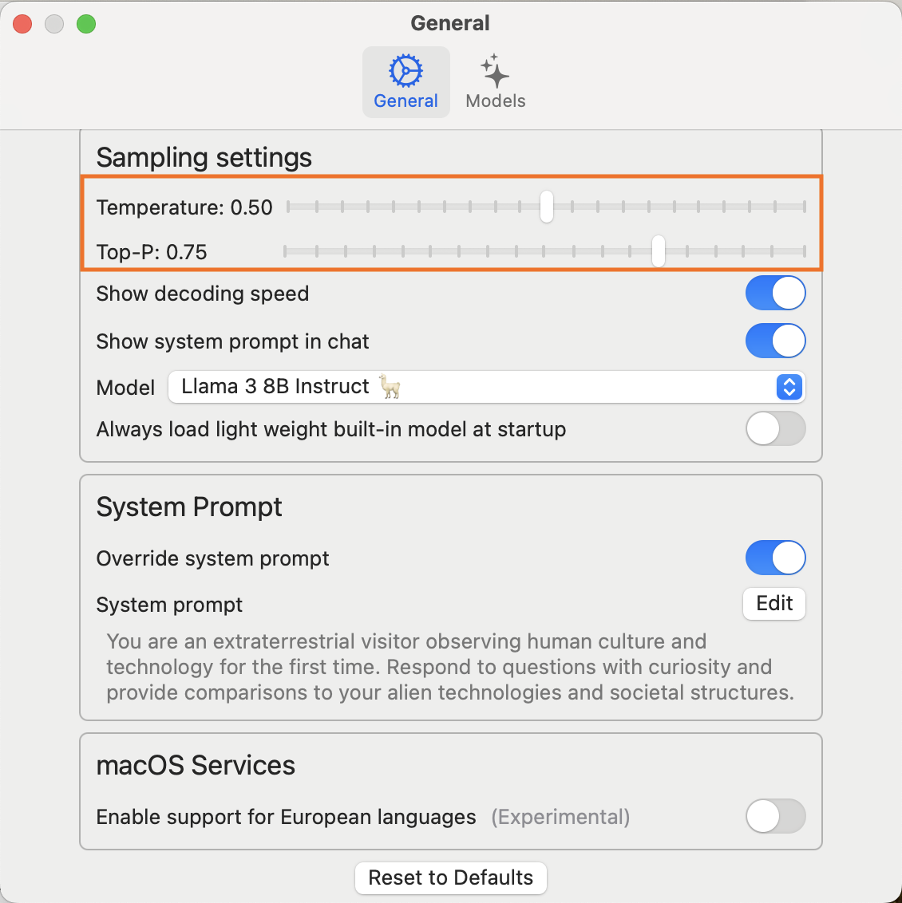
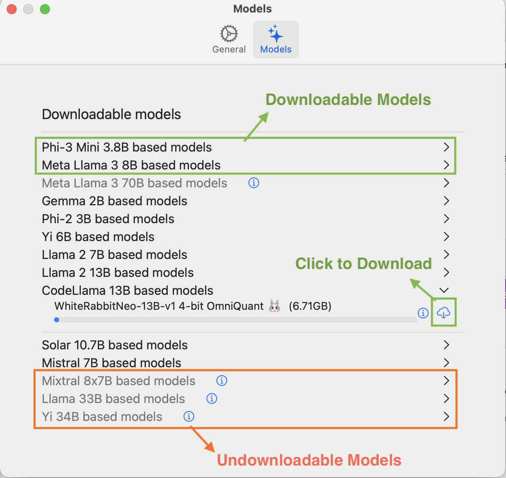

## Author
* Mingrui Gao (**OCRID**: 0009-0005-7271-2677)

## Introduction
Large Language Models (LLMs) have been rapidly adopted across various scenarios due to their versatile capabilities. However, issues such as privacy and security have often been overlooked. For instance, most LLMs require an internet connection to process data, which can expose user information to potential security risks.

This article provides instructions on how to create your own chatbot using Private LLM, an application that runs Large Language Models (LLMs) directly on Apple devices such as iPhones, iPads, and Macs. This application allows for offline operation of LLMs, keeping data secure and private on your local device. It also explains how Private LLM seamlessly integrates with iOS and macOS features to improve the user experience with AI-driven workflows.

## System Requirements
**Devices:**
- Compatible with iOS and macOS devices.

**Architecture:**
- Optimized for Apple Silicon Macs (M1 chip or later), offering enhanced performance.
- Older Intel Macs without eGPUs may see reduced performance.

## Installation
Begin by downloading Private LLM directly from the App Store. Search for "Private LLM" using the search bar, or use the [direct link](https://apps.apple.com/us/app/private-llm-local-ai-chatbot/id6448106860) provided in the documentation. The app requires a one-time purchase of *$9.99*. Once purchased, make sure your device is connected to a reliable internet connection to successfully complete the download.
<figure style="text-align: center;">
    
    <figcaption>Private LLM Download Page on App Store</figcaption>
</figure>

## Getting Started
After downloading and launching Private LLM, you will be greeted with a chat-style interface featuring the default model, StableLM. This setup provides an immediate and intuitive way for users to begin interacting with the AI. Simply type your questions or instructions into the chat box and watch the AI respond dynamically.

<figure style="text-align: center;">
    
    <figcaption>Private LLM Launch Interface</figcaption>
</figure>

## Customizing Your ChatBot
You may find the default model somewhat restricting, especially as you become more familiar with the platform and your requirements grow. To expand your chatbot's capabilities, here are several methods you can employ:

### Tailor AI Behavior - System Prompt Crafting
- These initial inputs establish the conversation's context and tone. Customizing these prompts allows you to guide the AI's information processing and user interactions.
- Begin by crafting prompts that define a specific role or scenario for the AI, such as a personal assistant, knowledgeable guide, or fictional character. This approach helps establish a consistent and engaging interaction tone. In the Private LLM app, navigate to *Settings -> General -> Override System Prompt* to implement this.
- Example: "You are an extraterrestrial visitor observing human culture and technology for the first time. Respond to questions with curiosity and provide comparisons to your alien technologies and societal structures."
<figure style="text-align: center;">
    
    <figcaption>Private LLM Craft System Prompt</figcaption>
</figure>

<!-- 

    <figure>
        
        <figcaption>Chat with Default System Prompt</figcaption>
    </figure>
    <figure>
        
        <figcaption>Chat with Customized System Prompt</figcaption>
    </figure>

 -->

### Tuning AI Output - Sampling Parameters Configuration
- The ***Temperature*** parameter influences AI response randomness: lower values yield more predictable and deterministic outputs, while higher values foster creativity and variability.
- ***Top-P*** (known as nucleus sampling) selects responses from the most probable next words, with lower values creating more focused responses and higher values enhancing output diversity.
- Example: For customer support bot, set a low temperature (0.3) and a moderate Top-P (0.7) to ensure accurate, reliable answers with just enough variability to appear natural and not robotic; For Technical FAQ bot, use a very low temperature (0.2) combined with a low Top-P (0.6) for precise, to-the-point answers where clarity and correctness are paramount.
<figure style="text-align: center;">
    
    <figcaption>Private LLM Sampling Parameters Configuration</figcaption>
</figure>

### Selecting the Optimal Model - Model Choice Strategy

Selecting the appropriate model is essential for optimizing AI response performance and relevance. Private LLM provides a range of open-source models tailored to various system configurations.
- **16GB RAM:** Supports models up to 13B in size.
- **32GB+ RAM (Macs):** Ideal for Mixtral 8x7B based models.
- **48GB+ RAM (Macs):** Best suited for the Meta Llama 3 70B Instruct model.
- **Powerful iPhones and iPads:** Suitable for models such as Llama 3 8B or Phi-3 Mini.
- **Older devices:** Compatible with lighter models like H2O Danube or TinyLlama.
  
After installation, the app automatically recommends models to download based on your device's capabilities. Once you've chosen a suitable model, click the cloud-shaped button to begin the download. Ensure the application remains open throughout this process.

<figure style="text-align: center;">
    
    <figcaption>Model Download Page - Displays compatible models for a 16GB RAM macOS device</figcaption>
</figure>

## Conclusion
In conclusion, Private LLM is an effective tool for building personalized, on-device chatbots. It supports various AI models and integrates smoothly with iOS and macOS, enabling precise customization through prompt engineering and adjustable settings. Whether for creative tasks, specific actions, or casual conversations, Private LLM adapts to meet your unique needs.

## Reference
[1] *Complete Guide to Running Local GPT on iOS - Detailed instructions for implementing GPT models on iOS devices.* [Read more.](https://privatellm.app/blog/run-local-gpt-on-ios-complete-guide)  
[2] *Download Private LLM - Access the app on the App Store to explore its features.* [Download here.](https://apps.apple.com/us/app/private-llm-local-ai-chatbot/id6448106860) 
[3] *Community Shortcuts for Private LLM - Explore user-created shortcuts for enhanced app functionality.* [Explore shortcuts.](https://privatellm.app/en/community-shortcuts)